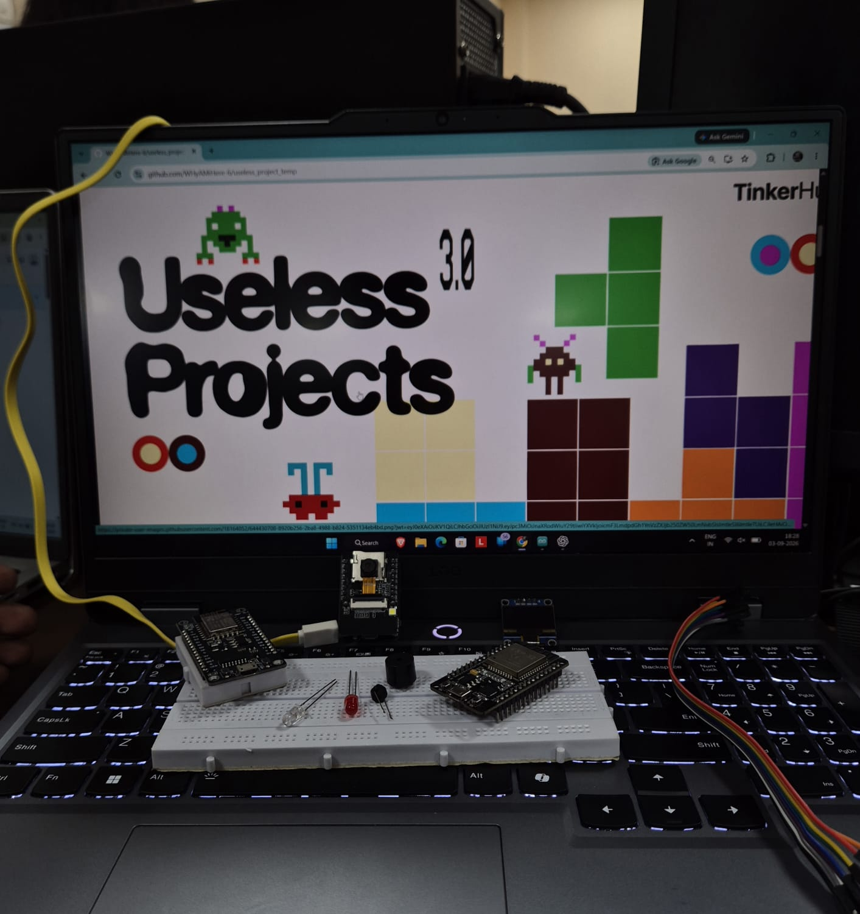
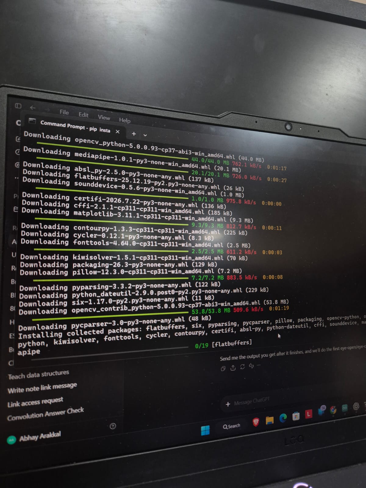
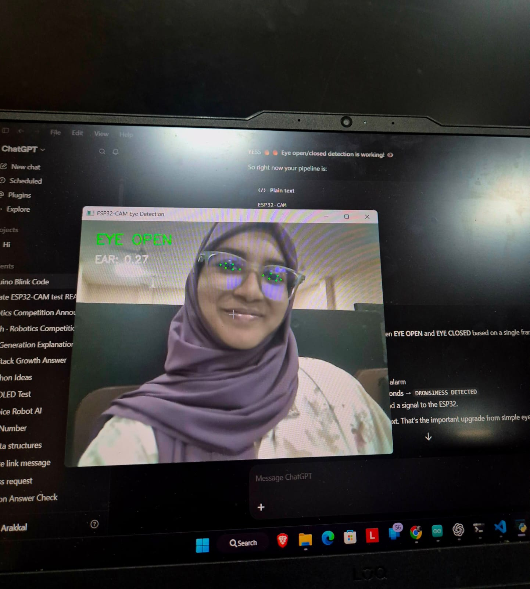
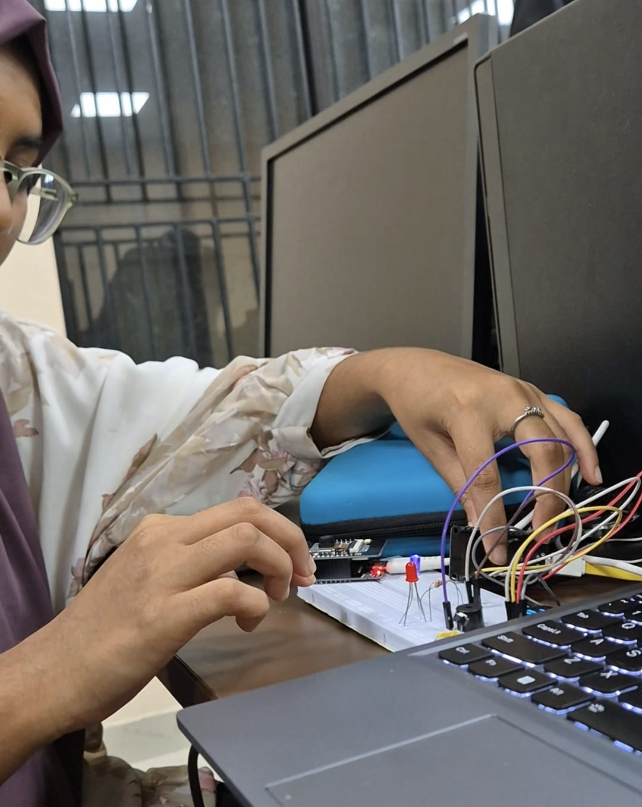
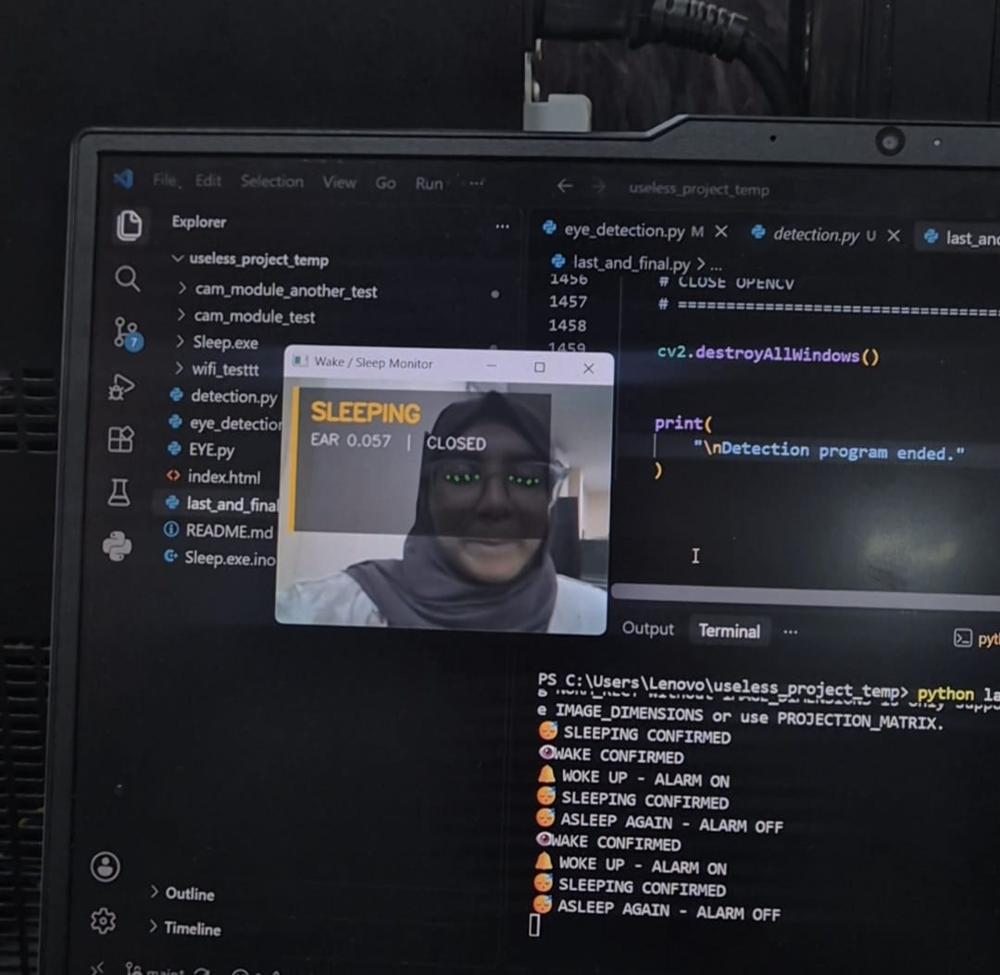
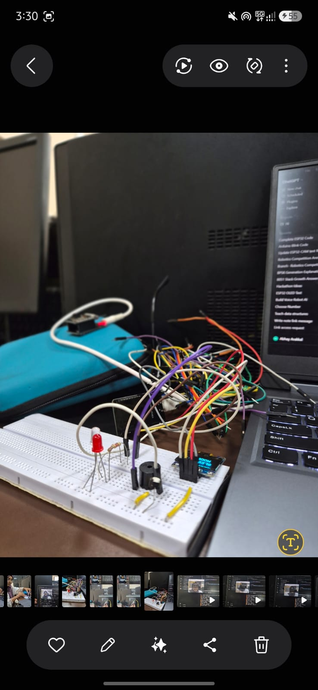

# Sleep.exe

## Basic Details

### Team Name: SIMPLE MINDS

### Team Members

* Team Lead: **ANSHA MEHRIN M N** - MODEL ENGINEERING COLLEGE THRIKKAKARA
* Member 2: **ABHAY ARAKKAL** - MODEL ENGINEERING COLLEGE THRIKKAKARA

---

## Project Description

**Sleep.exe** is a reverse alarm clock designed to do the exact opposite of what a normal alarm clock does.

Instead of helping the user wake up in the morning, **Sleep.exe tries to make them go back to sleep.**

At the user's scheduled wake-up time, the alarm starts buzzing. The system uses an **ESP32-CAM** to monitor the user's face and **computer vision** to determine whether their eyes are open or closed.

* 👁️ **Eyes open → Buzzer ON**
* 😴 **Eyes closed → Buzzer OFF**
* 👀 **Eyes open again → Buzzer ON again**

The alarm only stops when the system detects that the user has gone back to sleep.

In short:

> **An alarm clock that gets angry when you wake up! 😂**

---

## The Problem (that doesn't exist)

We already have alarm clocks that wake people up.

But we discovered another extremely important problem that nobody asked us to solve:

### **"What if I actually wake up when I have to?"** 😭

Early mornings are painful.

You have college.
You have work.
You have deadlines.

And sometimes all you really want to do is:

> **GO BACK TO SLEEP.**

So instead of creating another system to improve productivity, we decided to create a completely unnecessary system that actively discourages it.

---

## The Solution (that nobody asked for)

**Sleep.exe** is a reverse alarm clock that rewards the user for going back to sleep.

At the scheduled wake-up time:

1. The alarm starts buzzing.
2. The ESP32-CAM captures the user's face.
3. The camera feed is processed using computer vision.
4. The system determines whether the user's eyes are **open or closed**.
5. If the eyes are open, the buzzer continues to annoy the user.
6. Once the eyes remain closed for a specified period, the buzzer turns OFF.
7. If the user opens their eyes again, the buzzer starts again.

Because apparently,

> **even sleeping now needs verification.** 😂

---

# Technical Details

## Technologies/Components Used

### For Software

* C++
* Arduino IDE
* ESP32 programming environment
* Python
* OpenCV
* Wi-Fi communication
* Embedded image processing
* GitHub

### For Hardware

* ESP32-CAM (AI-Thinker)
* ESP32 DevKit
* Buzzer
* OLED display
* Push button
* LED
* Resistors
* Jumper wires
* Breadboard
* USB programmer
* USB/power supply

---

# System Architecture

The project uses two ESP32 boards and a laptop for processing.

```text
       📷 ESP32-CAM
             │
             │ Wi-Fi
             ▼
       💻 Laptop
             │
       Python + OpenCV
             │
       Eye Detection
             │
       ┌─────┴─────┐
       │           │
    👁️ OPEN     😴 CLOSED
       │           │
       ▼           ▼
   🔊 BUZZER     🔇 OFF
       │           │
       └─────┬─────┘
             │
             ▼
        ESP32 DevKit
             │
        ┌────┴────┐
        ▼         ▼
     🔊 Buzzer   📺 OLED
```

---

# Implementation

## System Flow

```text
              ┌────────────────────┐
              │ User sets wake-up  │
              │       time         │
              └─────────┬──────────┘
                        │
                        ▼
              ┌────────────────────┐
              │   Wake-up time     │
              │      reached       │
              └─────────┬──────────┘
                        │
                        ▼
              ┌────────────────────┐
              │    Buzzer ON 🔊    │
              └─────────┬──────────┘
                        │
                        ▼
              ┌────────────────────┐
              │    ESP32-CAM 📷    │
              │ Captures user's    │
              │      face          │
              └─────────┬──────────┘
                        │
                   Wi-Fi Stream
                        │
                        ▼
              ┌────────────────────┐
              │   Laptop 💻        │
              │ Python + OpenCV    │
              └─────────┬──────────┘
                        │
                        ▼
              ┌────────────────────┐
              │   Eye Detection    │
              └─────────┬──────────┘
                        │
                  ┌─────┴─────┐
                  │           │
                  ▼           ▼
              Eyes Open    Eyes Closed
                  │           │
                  ▼           ▼
             🔊 BUZZER ON   Confirm for
                            a few seconds
                                │
                                ▼
                         ┌─────────────┐
                         │  BUZZER OFF │
                         │     😴      │
                         └─────────────┘
                                │
                                ▼
                         Eyes open again?
                                │
                               YES
                                │
                                ▼
                         🔊 BUZZER ON
```

---

# Expected Behaviour

| User State                  | System Response             |
| --------------------------- | --------------------------- |
| ⏰ Wake-up time reached      | Alarm starts                |
| 👁️ Eyes open               | Buzzer keeps buzzing        |
| 😴 Eyes closed              | System verifies sleep       |
| 😴 Eyes closed continuously | Buzzer turns OFF            |
| 👀 Eyes open again          | Buzzer turns ON             |
| 📷 No face detected         | System continues monitoring |

---

## 🚀 Getting Started

### 1. Hardware Components

Before assembling the system, the required hardware components are shown below.



---

### 2. The ESP32-CAM Struggle 📷💀

Before getting to the actual drowsiness detection, we had to make the ESP32-CAM behave first!\
A *lot* of time went into testing the camera, adjusting the **video quality, resolution, and FPS**, and finding settings that gave us a smooth and usable video stream.


---

### 3. Downloading Libraries... Slowly 🐌

Once the camera was finally behaving, we had another challenge: installing all the required libraries.

The internet had other plans.\
Downloading and installing the libraries with our **slow internet connection** took surprisingly long — but eventually, we got everything set up! 😭



---

### 4. Eyes: Open or Closed? 👀

After surviving the ESP32-CAM setup and the library download boss fight, it was finally time for some actual computer vision. 😭

The first detection we implemented was **eye-state detection** — identifying whether the eyes were **open or closed**. Thankfully, this part came together pretty quickly! ⚡



---

### 5. Hardware Setup — Surprisingly Easy 🔌😌

After the software-side struggles, we finally got to the hardware setup.

Thankfully, connecting the ESP32 and ESP32-CAM and getting the required hardware connections in place was **pretty straightforward and quick**. No major drama this time. 😭😂



---

### 6. The UI Never Wanted to Cooperate 🫠💻

With both the ESP32 and ESP32-CAM connected, we started testing different UI designs.

And this is where we lost a lot of time. 😭

Getting the right UI, proper communication between the two ESPs, and everything working reliably together took several rounds of testing, changing, breaking, and testing again.

Eventually, we found a UI that actually worked the way we wanted. 🎉



---

### 7. The First Raw Setup 🔌💀

Finally, the raw setup was complete! 🎉

Everything was connected and working — which was great...

The wiring, however, was an entirely different story. 😭😂

At this stage, the setup was fully functional but absolutely covered in messy wires. It wasn't pretty, but hey — if it works, it works! 💀



---
